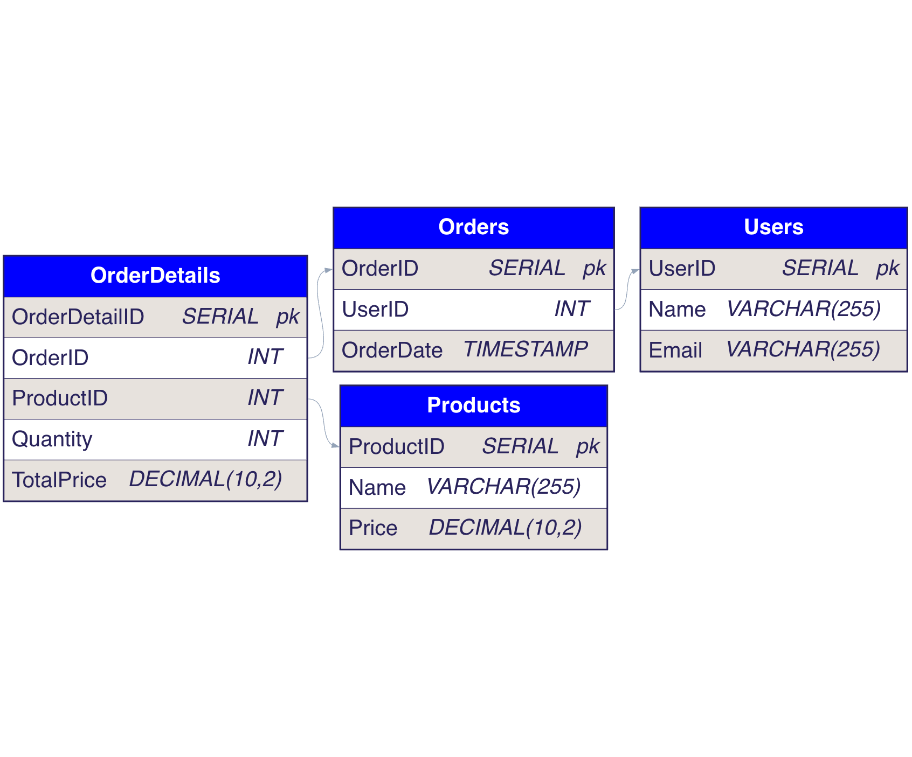

# E-Commerce Database Project

## Objective
This project demonstrates a relational database design for an e-commerce platform, showcasing features like user management, product catalog, orders, and payments. 

The database is implemented in SQL and includes:
- A well-structured schema.
- Preloaded sample data for demonstration.
- Advanced queries for analysis.

---

## Features
- **User Management:** Store user details with unique emails.
- **Product Catalog:** Manage a catalog of products with pricing.
- **Order Management:** Handle user orders, linking products to users.
- **Order Details:** Track individual products in each order and calculate totals.

---

## Technologies Used
- SQL
- PostgreSQL (Tested)

---

## Database Schema


### Tables:
1. **Users**: Stores user information.
2. **Products**: Stores product details and prices.
3. **Orders**: Tracks orders placed by users.
4. **OrderDetails**: Tracks products in each order with quantities and totals.

---

## Setup Instructions

### Prerequisites:
- PostgreSQL installed on your system.
- A database client like `psql`, pgAdmin, or DBeaver.

### Steps:
1. Clone this repository:
   ```bash
   git clone https://github.com/kiranxyz/database.git
   cd database
